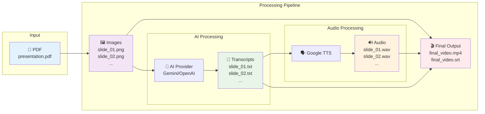

# PDF to Video Converter

An automated pipeline that converts PDF presentations into narrated videos with synchronized subtitles using AI-powered voice generation.

## 🚀 Features

- **PDF to Images**: Converts PDF slides to high-quality PNG images
- **AI-Powered Narration**: Generates voiceover scripts using Gemini or OpenAI APIs  
- **Multi-language Support**: Support for multiple languages and regional accents
- **Synchronized Subtitles**: Automatically generates SRT subtitle files

## 🔄 Processing Pipeline



The pipeline transforms your PDF presentation through these steps:
1. **📄 → 🖼️** Extract slides as high-quality images
2. **🖼️ → 📝** Generate descriptive narration using AI
3. **📝 → 🔊** Convert text to natural speech
4. **🖼️ + 🔊 + 📝 → 🎬** Combine into final video with subtitles

## 📋 Prerequisites

### System Requirements

- Python 3.8 or higher
- No additional system dependencies required! (PyMuPDF handles PDF processing)

### API Keys Required

1. **AI API** (choose one):
   - [Google Gemini API Key](https://aistudio.google.com/) - Get API key
   - [OpenAI API Key](https://platform.openai.com/api-keys) - Get API key

2. **Google Cloud TTS**:
   - [Google Cloud Console](https://console.cloud.google.com/) - Enable Text-to-Speech API
   - Download service account JSON credentials

## 🛠️ Installation

1. **Clone or download the project files**:
   ```bash
   # Your project should contain:
   # - pdf2video.py
   # - requirements.txt  
   # - TTS_credential.json (Google TTS credentials)
   ```

2. **Install Python dependencies**:
   ```bash
   pip install -r requirements.txt
   ```

3. **Create environment configuration**:
   Create a `.env` file in your project directory:
   ```env
   # API Configuration
   API_PROVIDER=gemini  # Options: gemini, openai
   GEMINI_API_KEY=your_gemini_api_key_here
   OPENAI_API_KEY=your_openai_api_key_here

   # Google Cloud TTS (Neural2 for high-quality speech)
   GOOGLE_APPLICATION_CREDENTIALS=./mytts-462902-282c7372d296.json
   TTS_LANGUAGE_CODE=en-US
   TTS_VOICE_NAME=en-US-Neural2-D
   TTS_VOICE_GENDER=NEUTRAL

   # File Configuration
   INPUT_PDF=presentation.pdf
   OUTPUT_DIR=output

   # Processing Configuration
   IMAGE_DPI=200
   AUDIO_FORMAT=wav  # wav for better quality, mp3 for smaller files
   VIDEO_QUALITY=23

   # Prompt Configuration  
   VOICEOVER_PROMPT=Describe this slide for a presentation voiceover. Be clear, concise, and engaging. This description will be read aloud to an audience.
   ```

## 📁 Project Structure

```
MyVideoProject/
├── .env                        # Configuration file
├── mytts-462902-282c7372d296.json  # Google TTS credentials
├── pdf2video.py               # Main script
├── requirements.txt           # Python dependencies
├── README.md                  # This file
├── presentation.pdf           # Your source PDF file
└── output/                    # Generated files (created automatically)
    ├── images/                # PNG slide images
    ├── transcripts/           # Generated voiceover scripts
    ├── audio/                 # Generated audio files
    ├── final_video.mp4        # Final output video
    └── final_video.srt        # Subtitle file
```

## 🎯 Usage

### Complete Pipeline
Convert your entire PDF to video:
```bash
python pdf2video.py
```

### Individual Steps
Run specific parts of the pipeline:

```bash
# Step 1: Convert PDF to images
python pdf2video.py --step images

# Step 2: Generate transcripts (requires images)
python pdf2video.py --step transcripts

# Step 3: Generate audio files (requires transcripts)
python pdf2video.py --step audio

# Step 4: Create final video (requires all previous steps)
python pdf2video.py --step video
```

### Custom Configuration
Use a different configuration file:
```bash
python pdf2video.py --config custom.env
```

## 📊 Output Files

The pipeline generates several outputs in the `output/` directory:

- **Images**: `slide_01.png`, `slide_02.png`, etc.
- **Transcripts**: `slide_01.txt`, `slide_02.txt`, etc.
- **Audio**: `slide_01.wav`, `slide_02.wav`, etc.
- **Video**: `final_video.mp4` (main output)
- **Subtitles**: `final_video.srt` (synchronized subtitles)
