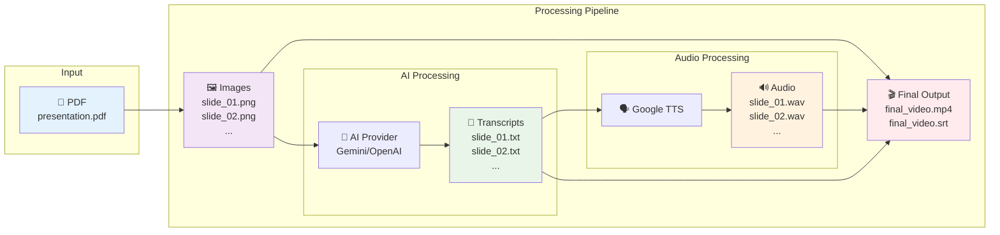

# PDF to Video Converter

An automated pipeline that converts PDF presentations into narrated videos with synchronized subtitles using AI-powered voice generation.

## 🚀 Features

- **PDF to Images**: Converts PDF slides to high-quality PNG images
- **AI-Powered Narration**: Generates voiceover scripts using Gemini or OpenAI APIs  
- **Multi-language Support**: Support for multiple languages and regional accents
- **Synchronized Subtitles**: Automatically generates SRT subtitle files

## 🔄 Processing Pipeline



The pipeline transforms your PDF presentation through these steps:
1. **📄 → 🖼️** Extract slides as high-quality images
2. **🖼️ → 📝** Generate descriptive narration using AI
3. **📝 → ✨** Polish transcripts for smooth narrative flow (optional)
4. **📝 → 🔊** Convert text to natural speech
5. **🖼️ + 🔊 + 📝 → 🎬** Combine into final video with subtitles

## 📋 Prerequisites

### System Requirements

- Python 3.8 or higher
- No additional system dependencies required! (PyMuPDF handles PDF processing)

### API Keys Required

1. **AI API** (choose one):
   - [Google Gemini API Key](https://aistudio.google.com/) - Get API key
   - [OpenAI API Key](https://platform.openai.com/api-keys) - Get API key

2. **Google Cloud TTS**:
   - [Google Cloud Console](https://console.cloud.google.com/) - Enable Text-to-Speech API
   - Download service account JSON credentials

## 🛠️ Installation

1. **Clone or download the project files**:
   ```bash
   git clone <repository-url>
   cd Slide2Video
   
   # Project includes:
   # - pdf2video.py (main script)
   # - src/ (modular source code)
   # - requirements.txt (dependencies)
   # - env.template (configuration template)
   ```

2. **Install Python dependencies**:
   ```bash
   pip install -r requirements.txt
   ```

3. **Create environment configuration**:
   Copy `env.template` to `.env` and configure your settings:
   ```bash
   cp env.template .env
   ```
   
   Edit the `.env` file with your API keys and preferences:
   ```env
   # API Configuration
   GEMINI_API_KEY=your_gemini_api_key_here
   OPENAI_API_KEY=your_openai_api_key_here

   # LLM Model Configuration
   GEMINI_MODEL=gemini-1.5-flash
   OPENAI_MODEL=gpt-4o-mini

   # Google Cloud TTS (Neural2 for high-quality speech)
   GOOGLE_APPLICATION_CREDENTIALS=./your-tts-credentials.json
   TTS_LANGUAGE_CODE=en-US
   TTS_VOICE_NAME=en-US-Neural2-D
   TTS_VOICE_GENDER=NEUTRAL
   TTS_SPEAKING_RATE=1.0  # 0.25 to 4.0 (1.0 = normal speed)

   # File Configuration (optional - can be overridden by command line)
   INPUT_PDF=presentation.pdf
   OUTPUT_DIR=output

   # Processing Configuration
   IMAGE_DPI=200
   AUDIO_FORMAT=wav  # wav for better quality, mp3 for smaller files
   VIDEO_QUALITY=23  # CRF value: 18-28 (lower = higher quality)
   VIDEO_PRESET=medium  # Encoding preset
   RESOLUTION_SCALE=1.0  # Resolution scaling: 1.0 = original size

   # Transcript Polishing (optional)
   ENABLE_POLISHING=false

   # Prompt Configuration  
   VOICEOVER_PROMPT=Describe this slide for a presentation voiceover. Be clear, concise, and engaging.
   ```

## 📁 Project Structure

```
Slide2Video/
├── .env                       # Configuration file (copy from env.template)
├── env.template              # Environment configuration template
├── your-tts-credentials.json # Google TTS credentials
├── pdf2video.py              # Main script
├── requirements.txt          # Python dependencies
├── README.md                 # This file
├── presentation.pdf          # Your source PDF file
├── src/                      # Source code modules
│   ├── __init__.py
│   ├── ai_providers.py       # AI provider implementations
│   ├── config.py             # Configuration management
│   ├── pipeline.py           # Main processing pipeline
│   └── processors/           # Processing modules
│       ├── __init__.py
│       ├── audio_processor.py      # Audio generation
│       ├── pdf_processor.py        # PDF to image conversion
│       ├── transcript_polisher.py  # Transcript polishing
│       ├── transcript_processor.py # Transcript generation
│       └── video_processor.py      # Video creation
└── output_<PDF_NAME>/        # Generated files (created automatically)
    ├── images/               # PNG slide images
    ├── transcripts/          # Generated voiceover scripts
    ├── polished_transcripts/ # Polished voiceover scripts (if enabled)
    ├── audio/                # Generated audio files
    ├── final_video.mp4       # Final output video
    └── final_video.srt       # Subtitle file
```

## 🎯 Usage

### Complete Pipeline
Convert your entire PDF to video:
```bash
python pdf2video.py -i presentation.pdf
```

### Individual Steps
Run specific parts of the pipeline:

```bash
# Step 1: Convert PDF to images
python pdf2video.py -i presentation.pdf --step images

# Step 2: Generate transcripts (requires images)
python pdf2video.py -i presentation.pdf --step transcripts

# Step 3: Polish transcripts (optional, requires transcripts)
python pdf2video.py -i presentation.pdf --step polish

# Step 4: Generate audio files (requires transcripts or polished transcripts)
python pdf2video.py -i presentation.pdf --step audio

# Step 5: Create final video (requires all previous steps)
python pdf2video.py -i presentation.pdf --step video
```

### Additional Options
Specify custom output directory:
```bash
python pdf2video.py -i presentation.pdf -o my_custom_output
```

Use a different configuration file:
```bash
python pdf2video.py -i presentation.pdf --config custom.env
```

Specify number of threads for processing:
```bash
python pdf2video.py -i presentation.pdf -t 16
```

Choose AI provider:
```bash
python pdf2video.py -i presentation.pdf -p openai
```

## 📊 Output Files

The pipeline generates several outputs in the `output_<PDF_NAME>/` directory:

- **Images**: `slide_01.png`, `slide_02.png`, etc.
- **Transcripts**: `slide_01.txt`, `slide_02.txt`, etc.
- **Polished Transcripts** (optional): `slide_01.txt`, `slide_02.txt`, etc.
- **Audio**: `slide_01.wav`, `slide_02.wav`, etc.
- **Video**: `final_video.mp4` (main output)
- **Subtitles**: `final_video.srt` (synchronized subtitles)

The output directory is automatically named based on your PDF filename. For example, if your PDF is named `presentation.pdf`, the output will be in `output_presentation/`.
